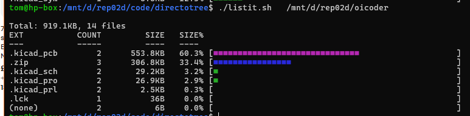
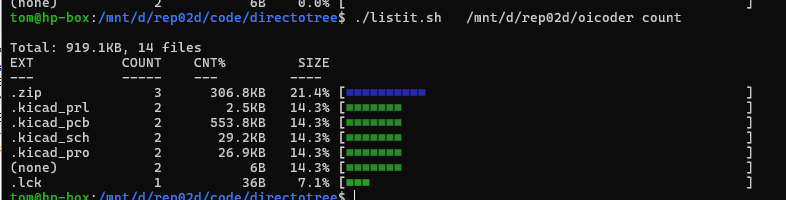

## OK, so kinda like WizTree - but in bash?

#### Sort by size (default)

* ./directotree.sh`<path> -s  `
* ./directotree.sh`<path> size`

#### Sort by count

* ./directotree.sh`<path> -c  `
* ./directotree.sh`<path> count`

(I'm so sorry Linus, I hope you never see this junk.)
